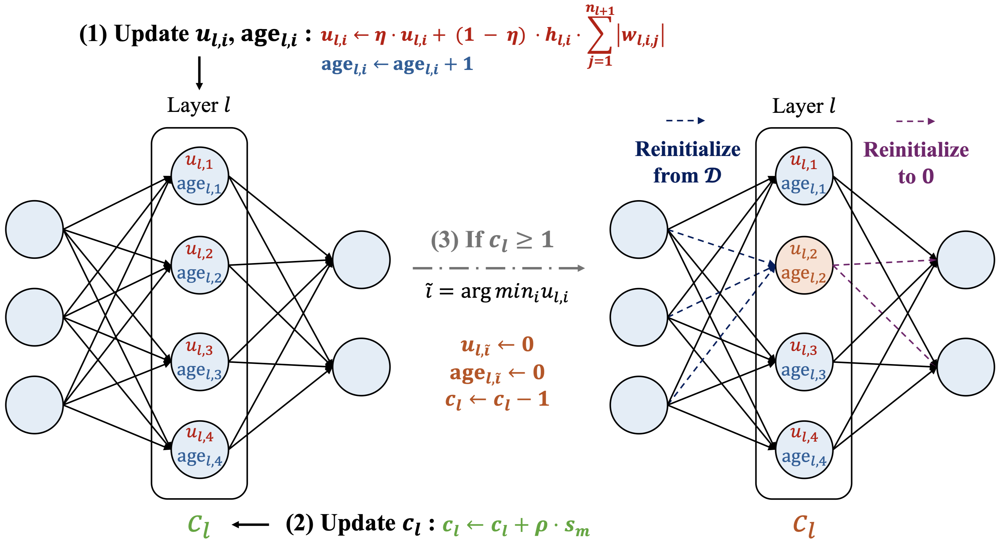
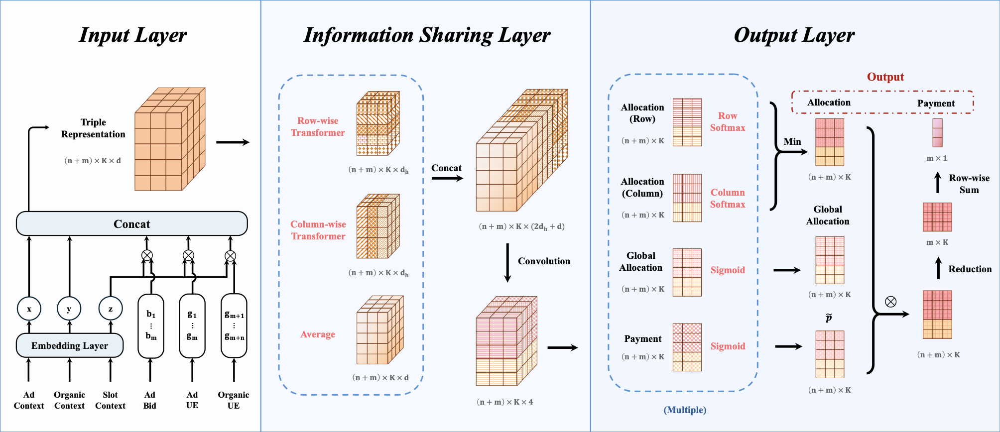








I am currently a **junior** at [Gaoling School of Artificial Intelligence](http://ai.ruc.edu.cn/), [Renmin University of China](https://www.ruc.edu.cn/). I was an exchange student at [University of California, Davis](https://www.ucdavis.edu/) (Jan 2025 -- Mar 2025) and will become a visiting research student at [Dalhousie University](https://www.dal.ca/) this summer (Jul 2025 -- Oct 2025), sponsored by [Mitacs, Canada](https://www.mitacs.ca/).

My research interests focus on **reinforcement learning, online learning, continual learning, recommender systems, and computational advertising**. Recently, I am focusing on:  
(1) sequential bidding ranking algorithms;  
(2) machine unlearning in generative recommendation.  
My research aims to build **intelligent systems that are elegant in theory and effective in practice**, and provide credible solutions to the urgent needs of contemporary society.

# 🔥 News
- *2025.05.15*: &nbsp;🎉 A paper about clustering of neural bandits is accepted by KDD 2025. Congratulations to myself on my **first first-author paper**!
- *2025.03.25*: &nbsp;🎉 Complete Global Study Program at UC Davis and achieved **Academic Perfection**.
- *2025.02.03*: &nbsp;🎉 A paper about intergrating ad auctions and recommendations is accepted by WWW 2025.
- *2024.12.10*: &nbsp;🎉 Admitted to the Mitacs Globalink Research Internship **full-scholarship** summer research program.

# 📝 Publications

KDD 2025

  
[Revisiting Clustering of Neural Bandits: Selective Reinitialization for Mitigating Loss of Plasticity](https://dl.acm.org/doi/pdf/10.1145/3696410.3714779?casa_token=8lqAC8Liak8AAAAA:lbsi8gr5tQAQds4gSyTdM3a7Rl43lK1yXwjDzjOtcXOxydg_JQJfvJxQtUKGAPxbZNspu3OlGT5ZcQ)

**Zhiyuan Su**, Sunhao Dai, Xiao Zhang

- *Accepted at KDD 2025 Research Track (Acceptance Rate: 18.4%)*

WWW 2025

[A Context-Aware Framework for Integrating Ad Auctions and Recommendations](https://dl.acm.org/doi/pdf/10.1145/3696410.3714779?casa_token=8lqAC8Liak8AAAAA:lbsi8gr5tQAQds4gSyTdM3a7Rl43lK1yXwjDzjOtcXOxydg_JQJfvJxQtUKGAPxbZNspu3OlGT5ZcQ)

Yuchao Ma, Weian Li, Yuejia Dou, **Zhiyuan Su**, Changyuan Yu, Qi Qi

- *Accepted at WWW 2025 (Acceptance Rate: 20.2%)*

# 🎖 Honors and Awards
- *2025.04*: 🏆 *Municipal Approval* for Student Innovation Project – 7,500 CNY
- *2025.01*: 💰 Mitacs-CSC Co-sponsored Scholarship – 6,000 CAD
- *2024.12*: 🏆 *National Second Prize*, 19th "Challenge Cup" National Undergraduate Curricular Academic Science and Technology Works
- *2024.10*: 🏆 *Second Prize*, Beijing Mathematical Contest in Modeling
- *2024.10*: 💰 *Second-class* Academic Scholarship – 3,000 CNY
- *2024.04*: 🏆 *Municipal Approval* for Student Innovation Project – 7,500 CNY
- *2024.04*: 🎖 Outstanding Communist Youth League Member

# 📖 Educations
- *2025.01 – 2025.03*: 🇺🇸 **Global Study Program, University of California, Davis**
  
  *Major: Mathematics & Statistics, Graduated with Academic Perfection*

- *2022.09 – Present*: 🇨🇳 **Gaoling School of Artificial Intelligence, Renmin University of China**
  
  *Bachelor of Engineering in Artificial Intelligence, Advisors: [Prof. Qi Qi](https://gsai.ruc.edu.cn/qiqi), [Prof. Xiao Zhang](https://pinkfloyd1989.github.io/Xiao_Zhang/)*

# 💻 Work Experiences

- *2025.07 – 2025.10*: 🇨🇦 *Mitacs Globalink Research Intern & Visiting Research Student*, Dalhousie University
- *2024.11 – Present*: 🇨🇳 *Research Intern*, Beijing Key Laboratory of Research on Large Models and Intelligent Governance
- *2024.05 – 2024.09*: 🇨🇳 *Research Intern*, Engineering Research Center of Next-Generation Intelligent Search and Recommendation, MOE
- *2023.10 – 2024.09*: 🇨🇳 *RUC-Baidu Pinecone Talent Elite Project*, Baidu Inc.

# 🪽 Beyond Academics

I love **music, literature, travel and badminton**. I am a **campus singer** at Renmin University of China and have been invited to participate in various concerts and music festivals at RUC. I am also a **musician at NetEase Cloud Music**, and my stage name is [艾诺 Ayinor](http://music.163.com/#/artist?id=36180214). Recently, I am also working on my own new song, so stay tuned!

